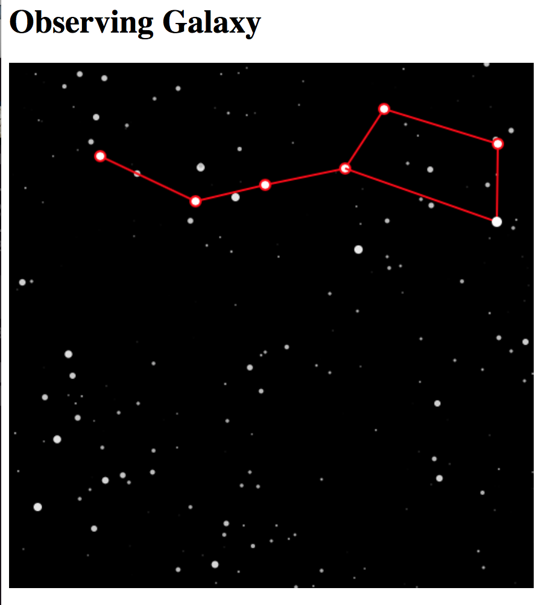

# Dipper Proof-of-work

This is a memory-hard proof-of-work algorithm. It's based on vector
algebra and computer graphics designed to search for "The Big Dipper"
(the constellation) in a randomly generated star cluster (or galaxy.)

Although it is hard to construct proofs for finding them, it takes
rather limited resources to verify a given proof.

## Still not officially published!

Although you may have found this, but this is still not officially
published. I'm still polishing the paper.

## Compile the code

```
git clone https://github.com/datavetaren/dipper_pow
make
```

Should work on Linux, Windows and MacOS.

Windows uses make.bat. But make.bat also provides "make vcxproj" and
"make vssln" to create Visual Studio projects and solution.

Linux and MacOS use Makefile. I've tried to minimize use of other
tools.  I'm not even using 'configure' that is typically common for
such projects.

## Running the code

To test the PoW algorithm for mining you can use:

```
bin/test/dipper/test_mining --mining
```

To browse around in the galaxy manually you can start the mock HTTP
server at port 8080 with:

```
bin/test/dipper/test_pow_server --server
```

This will initialize a galaxy for seed 'hello42'.

Then in a browser you can type the URL (make sure you're in dipper_pow/ root directory, i.e. the parent of src/ and bin/):

```
http://localhost:8080/render.html?nonce=3661
```



You can move the orientation of the camera with keys A, Z, I, J, K and L.

